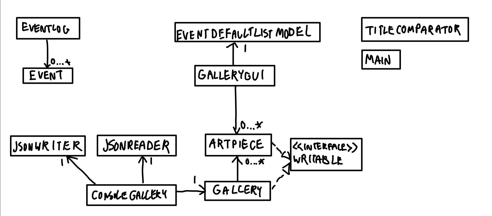

# Art Gallery
## A program to organize my art

This is a program to **store and organize my artworks**. This is made for a way to keep my artworks organized. 
I often enjoy making artworks but right now it's all in one folder - *hopefully* this helps me organize.


This program can store a piece's:
- Title
- Medium
- Subject

## User Stories
- As a user, I want to be able to add an artwork to my gallery
- As a user, I want to be able to view the list of artworks in my gallery
- As a user, I want to be able to view a single artwork in my gallery and view it in detail
- As a user, I want to be able to sort the gallery by title
- As a user, I want to be able to organize the gallery by medium or subject
- As a user, I want to be able to be able to save my gallery
- As a user, when I start the application, I want to be given the option to load my gallery from file.

## Event Logging Sample
```
Saved to ./data/gallery.json
Wed Nov 24 21:43:28 PST 2021
List was cleared
Wed Nov 24 21:43:28 PST 2021
Loaded Gallery
Wed Nov 24 21:43:28 PST 2021
Added Artpiece:
Wed Nov 24 21:43:28 PST 2021
Added Artpiece: Face
Wed Nov 24 21:43:28 PST 2021
Added Artpiece: 1
Wed Nov 24 21:43:28 PST 2021
Added Artpiece: Llama
Wed Nov 24 21:43:44 PST 2021
Added Artpiece: Face
Wed Nov 24 21:43:50 PST 2021
Removed Art Piece: 1
Wed Nov 24 21:43:54 PST 2021
Saved Gallery
```

##Phase 4: Task 3

If I had more time to work on the project, I would probably try to:
- not use the DefaultListModel for the user interface. It does not make good use of the gallery methods I had provided earlier.
- Add more components to GalleryGUI to divide the tasks.

## Citations
-Data Persistence is modelled after JsonSerializationDemo from CPSC 210
